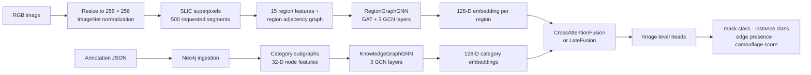

# Multimodal Camouflage Detection

## Overview

This repository contains an experimental PyTorch/PyTorch Geometric pipeline for camouflage detection that combines a **region graph (RG)** from image superpixels with a Neo4j-backed **knowledge graph (KG)** from organism/environment annotations. Both are learned as embeddings and fused by cross-attention.

It includes two distinct output paths. The standalone RG path reconstructs a 256 × 256 probability mask from region predictions. The multimodal fusion path is an image-level model; it does **not** generate a pixel mask.

## Problem Statement

Camouflaged objects can resemble their surroundings in color, texture, and boundary structure. This project explores whether local visual regions and structured organism/environment metadata can be combined for binary camouflage classification and related image-level auxiliary predictions.

## Key Features

- SLIC superpixels and region-adjacency graphs with 15 hand-engineered visual features per region.
- Multi-task RG GNN for region mask, instance, and edge predictions.
- Neo4j ingestion of organism, environment, appearance, observation, and camouflage-assessment annotations.
- Category-level KG embeddings trained to regress camouflage scores.
- Cross-attention or late-fusion multimodal model.
- Scripts for graph/KG training, embedding extraction, inference, evaluation, and visualization.

## Architecture



| Component | Implementation | Verified behavior |
| --- | --- | --- |
| Region graph | `models/region_graph/train.py` — `CODDataset.create_region_graph` | SLIC partitions a resized image; a region-adjacency graph connects adjacent superpixels with color/texture/edge-dependent weights. |
| Visual encoder | `RegionGraphGNN` in `train.py` and `extract_rg_embeddings.py` | One `GATConv`, then three `GCNConv` layers at 128 channels; `fc_shared` yields 128-D node embeddings. |
| KG ingestion | `models/knowledge_graph/ingest_to_neo4j.py` — `extract_structured`, `CamouflageKnowledgeGraphV2` | Creates graph nodes and relations from annotation JSON. |
| KG encoder | `models/knowledge_graph/train_model.py` — `KnowledgeGraphGNN`, `Neo4jGraphExtractorV2` | Three GCN layers, global mean pool, then a 128-D embedding; trained with MSE against camouflage score. |
| Fusion | `models/multimodal/fusion_model.py` — `CrossAttentionFusion`, `LateFusion` | Bidirectional RG/KG attention, sequence mean pooling, then fusion. |
| Fusion training | `models/multimodal/train_multimodal.py` — `train_multimodal_fixed` | Learns image-level outputs from RG node and KG embeddings. |

## How It Works

1. `extract_rg_embeddings.py` resizes an RGB image to 256 × 256, applies ImageNet normalization, then denormalizes it for graph-feature creation.
2. `create_region_graph` uses `skimage.segmentation.slic` with `n_segments=500`, `compactness=10`, and `sigma=1`. Region features are mean/std RGB, grayscale mean/std, normalized center, area, compactness, boundary contrast, Canny-edge density, and local grayscale variance.
3. `RegionGraphGNN.extract_node_embeddings` returns one 128-D vector per region. Batch extraction saves these by image in `all_rg_embeddings.pt`.
4. The KG ingester reads per-image JSON and populates Neo4j. `Neo4jGraphExtractorV2` retrieves category subgraphs and encodes nodes in 32 dimensions: type, selected numeric values, and limited color/texture vocabularies.
5. `KnowledgeGraphGNN.get_embedding` produces 128-D category embeddings by mean-pooling extracted subgraphs.
6. `EmbeddingMatcher.create_matched_dataset` pairs every RG image with all KG category vectors by default; its alternative is heuristic filename-to-category matching.
7. `MultimodalCamouflageDetector` cross-attends in both directions and returns two-class mask logits, two-class instance logits, one edge logit, and a sigmoid score.

### Labels and evaluation

The multimodal trainer does not output dense masks. `SmartMultimodalDataset.extract_label_from_mask` turns each object mask into an image-level binary label through mask, contour, and edge heuristics: **0 = not camouflaged**, **1 = camouflaged**. Training uses focal loss for the main class, cross-entropy for instance class, BCE-with-logits for image-level edge presence, and MSE for mean mask intensity. Validation reports loss, per-class/average F1, and per-class accuracy.

The standalone RG script (`models/region_graph/test.py`) assigns each superpixel the region-GNN class-1 probability and reconstructs a 256 × 256 mask. With `--mask`, it calculates IoU, Dice, precision, recall, and F1 at threshold 0.5. `utils/metrics.py` provides generic segmentation helpers but is not imported by the training scripts.

## Dataset

```text
data/COD10K/
├── images/       # 6,000 images
├── gt_object/    # 6,000 object masks
├── gt_instance/  # 6,000 instance masks
└── gt_edge/      # 6,000 edge masks
```

Filenames and directories identify this as COD10K-formatted data. Its exact source, license, official split, and provenance are **not determined from the repository**.

`models/knowledge_graph/annotations/` contains 6,000 JSON files. An inspected annotation contains `object_category`, `object_name`, background description, similarity labels, camouflage score, confidence, camouflage type, and explanation. The repository ingests these annotations; it does not generate them.

## Technologies

- Python, PyTorch, TorchVision, PyTorch Geometric
- scikit-image, SciPy, OpenCV, Pillow, NumPy, Matplotlib
- Neo4j, PyYAML, tqdm, python-dotenv

Dependency manifests: `models/requirements.txt` and `models/region_graph/requirements.txt`. They do not pin a reproducible environment; `python-dotenv` is imported by KG scripts but omitted from both manifests.

## Project Structure

```text
configs/multimodal_config.yaml       Fusion paths and hyperparameters
data/COD10K/                         Images and aligned ground-truth directories
models/
├── region_graph/                    RG training, extraction, and mask inference
├── knowledge_graph/                 Annotations, Neo4j ingestion, KG training/extraction
└── multimodal/                      Fusion model, matching, training, and inference
utils/                               General metrics and plotting helpers
test_images/                         Example inputs
results/                             Committed fusion visualization examples
```

## Installation

Use a Python environment compatible with the PyTorch and PyTorch Geometric builds you choose, then install the declared dependencies:

```bash
pip install -r models/requirements.txt
pip install -r models/region_graph/requirements.txt
pip install python-dotenv
```

PyTorch Geometric extension compatibility depends on the selected PyTorch/CUDA build. Exact supported versions and hardware requirements are **not determined from the repository**. Scripts use CUDA if available, otherwise CPU.

KG operations require Neo4j and a `.env` file:

```dotenv
NEO4J_URI=...
NEO4J_USER=...
NEO4J_PASS=...
TARGET_DB=...
```

The intended Neo4j version and deployment method are not determined from the repository.

## Configuration

`configs/multimodal_config.yaml` contains fusion settings, embedding/data paths, and checkpoint directory. Its checked-in embedding paths are machine-specific Windows paths; the KG path also includes a duplicated `models/models` segment. Correct them before fusion training.

Configured defaults are 128-D RG/KG inputs, 256-D hidden state, 8 heads, cross-attention, 2 classes, 0.3 dropout, 30 epochs, batch size 4, learning rate 0.0005, and weight decay 0.0001. The YAML task weights and split values are not used by `train_multimodal.py`; that script hard-codes an 80/20 split and loss multipliers.

## Usage

Run commands from repository root unless noted. Compatible model checkpoints and combined embeddings are prerequisites. No `.pth` checkpoint is present in this checkout, and RG `.pt` artifacts are Git LFS pointers rather than resolved tensor files; fetch/provide artifacts before extraction or inference.

### Training

#### Region graph

```bash
python models/region_graph/train.py
```

This script has no CLI options and hard-codes `COD10K/images`, `COD10K/gt_object`, `COD10K/gt_instance`, and `COD10K/gt_edge`, which do not match the checked-in `data/COD10K/...` layout. Update those paths (or provide the expected layout) first. It writes `best_model.pth` and `region_graph_model.pth` to the current directory.

#### Knowledge graph

KG scripts resolve `./annotations` and `./processed_files.txt` relative to the current directory:

```bash
cd models/knowledge_graph
python ingest_to_neo4j.py
python train_model.py
```

Ingestion creates the Neo4j schema and processes annotation JSON not listed in `processed_files.txt`. Training makes a random 80/20 split, runs 50 epochs with batch size 32, and writes `kg_gnn_model_v2.pth`.

#### Embedding extraction

```bash
python models/region_graph/extract_rg_embeddings.py \
  --model /path/to/best_model.pth \
  --image-dir data/COD10K/images \
  --output models/region_graph/rg_embeddings
```

RG extraction writes individual files, `all_rg_embeddings.pt`, and `embedding_summary.json`. For KG extraction, run from the KG directory:

```bash
cd models/knowledge_graph
python extract_kg_embeddings.py --model kg_gnn_model_v2.pth --output kg_embeddings
```

It writes per-category embeddings, `all_embeddings.pt`, `embedding_stats.json`, and `summary.json`.

#### Multimodal fusion

After correcting YAML paths:

```bash
python models/multimodal/train_multimodal.py --config configs/multimodal_config.yaml
```

The best class-1-F1 checkpoint is `multimodal_best_fixed.pth`; history is saved as `training_history_fixed.json` under `checkpoint_dir`.

### Evaluation

Standalone RG mask evaluation:

```bash
python models/region_graph/test.py \
  --image test_images/img15.jpg \
  --model /path/to/region_graph_model.pth \
  --mask /path/to/ground_truth.png \
  --output results
```

It saves heatmap/overlay/binary-mask visualizations and a grayscale prediction mask. Metrics print only when `--mask` is given. There is no batch RG evaluator.

The fusion entry point is prediction-oriented; it does not compute ground-truth metrics:

```bash
python models/multimodal/test_multimodal.py \
  --checkpoint /path/to/multimodal_best_fixed.pth \
  --rg-model /path/to/best_model.pth \
  --kg-embeddings /path/to/all_embeddings.pt \
  --image test_images/img15.jpg \
  --output results
```

### Inference

Use the fusion command above with `--image` for one image. For a directory, replace it with `--image-dir /path/to/images`; `--max-images N` optionally limits processing. Batch mode writes one visualization per input and `batch_results.json`, containing the prediction, both class probabilities, and score-head output.

## Results

The checked-in RG embedding summary reports 6,000 successful extractions, zero failures, 128-D embeddings, 500 requested SLIC segments, and 13,296.82 seconds total processing time. Its `model_path` is `null`.

The KG summary reports 13 128-D categories: Environment, Bird, Mammal, Fish, Insect, Amphibian, Reptile, Crustacean, Arachnid, Mollusc, Echinoderm, Chilopoda, and Mollusk.

No committed training logs, multimodal checkpoint, or aggregate accuracy/IoU/F1 result exists. Final model performance is **not determined from the repository**.

## Example Outputs

- `results/prediction_img15.jpg` and other `results/prediction_*.jpg`: fusion visualizations with superpixels, class probabilities, score, and top KG attention categories where available.
- `models/region_graph/results/detection_img15.jpg` and `mask_img15.jpg`: standalone RG heatmap/overlay and reconstructed mask.
- `models/region_graph/analysis_results/analysis_img15.jpg`: analysis visualization; its generator is not present.

These show output format only; corresponding quantitative results are not recorded.


## References

- COD10K source/license: not determined from the repository.
- No paper, DOI, or external methodological reference is included.

